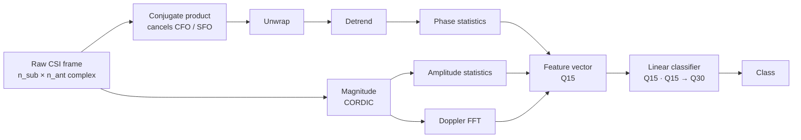

# qcsi

[](https://github.com/andrealo20/qcsi/actions/workflows/ci.yml)
[](LICENSE)
[](https://en.wikipedia.org/wiki/C99)
[](tests/)
[](.github/workflows/ci.yml)
[](#api)
[](https://github.com/andrealo20/qdsp)

**Wi-Fi CSI sensing on a microcontroller, in fixed point.**

Built on [qdsp](https://github.com/andrealo20/qdsp), which supplies the
fixed-point arithmetic, filters and FFT. `qcsi` adds what is specific to
Channel State Information: phase sanitisation, feature extraction, and a
quantised classifier; all in C99, with no dynamic allocation and no floating
point on the processing path.

43 unit tests. Clean under `-Wall -Wextra -Wpedantic -Wconversion -Werror`,
AddressSanitizer and UndefinedBehaviorSanitizer.

---

## What problem this solves

A body moving through a room perturbs the Wi-Fi channel measurably. Every
received frame exposes the channel response across tens of subcarriers, the
CSI, and a sequence of frames carries the signature of the motion. That is
the basis for activity recognition, fall detection and vital-sign monitoring
with no cameras and nothing worn.

Almost all of that research runs in Python on a workstation. This library
runs the same processing in fixed-point C on a microcontroller-shaped budget,
with the per-frame cost measured and the accuracy compared against the
floating-point reference rather than asserted.



---

## The hard part: phase

Raw CSI phase from a single antenna is unusable. Each packet carries an
unknown carrier frequency offset (CFO) and sampling frequency offset (SFO).
For antenna $a$, the measured phase at subcarrier $k$ is

$$\phi_a[k] = \phi^{\text{phys}}_a[k] + \underbrace{\theta_{\text{cfo}}}_{\text{random per packet}} + \underbrace{\beta_{\text{sfo}} \, k}_{\text{random slope}}$$

so two packets of an identical static scene can have completely different raw
phase. This is why most published work discards phase and keeps only
amplitude.


*Twelve packets of one unchanging scene. On the left the impairment moves the
raw phase anywhere in $[-\pi, \pi)$; on the right the conjugate product
cancels it and all twelve land on the same curve, the dashed reference. The
figure computes the conjugate product rather than asserting it, and uses two
distinct physical responses so the recovered quantity really is a difference.
Generated data, legitimate for showing an identity, not as evidence.*

But $\theta_{\text{cfo}}$ and $\beta_{\text{sfo}}$ come from **one shared
local oscillator and one shared sampling clock**, so they are identical
across the antennas of the same receiver. Multiplying antenna $a$ by the
conjugate of antenna $b$ cancels them exactly:

$$\angle\left(H_a[k] \, \overline{H_b[k]}\right) = \phi^{\text{phys}}_a[k] - \phi^{\text{phys}}_b[k]$$

One complex multiply, no estimation step, nothing to tune. That identity is
the core of the library.

### It holds but only for one antenna pair


*Above the dashed line the impairment shrank; below it, the operation made
things worse.*

Measured on SignFi (Intel 5300, 1500 captures, median within capture):

| Antenna pair | Offset reduction | Slope reduction |
|---|---|---|
| **rx0 – rx1** | **2.5×** | **1.52×** |
| rx0 – rx2 | 1.1× | 0.97× |
| rx1 – rx2 | 1.1× | 0.97× |

Antenna imbalance does not explain the pattern, mean amplitudes were 74.0,
74.3 and 96.6, so all three were receiving well. **Why the third antenna does
not share the impairment is not established**, and is recorded as open rather
than guessed at in [`docs/design.md`](docs/design.md). The practical
consequence stands without the explanation: the antenna pair has to be
measured per receiver, which is why `check_dataset.py` tries every pair.

---

## Fixed-point design

Angles use **binary angular measure**: a signed 16-bit value where a full
turn is $2^{16}$, so $32768 \mapsto \pi$ and the range is exactly
$[-\pi, \pi)$. Because the type wraps modulo a turn, the difference of two
angles *is* the shortest-path difference, with no branch and no special case
at the seam. Unwrapping reduces to

$$\Phi[0] = \phi[0], \qquad \Phi[k] = \Phi[k-1] + \big(\phi[k] - \phi[k-1]\big)_{\bmod 2^{16}}$$

`atan2` and magnitude come from a **CORDIC** in vectoring mode: only shifts,
adds and a small table, no multiplications, no division, which is what
makes it right for a core without a hardware multiplier. One pass yields both.

| Measurement | Result |
|---|---|
| CORDIC `atan2` against libm | 3 LSB max (0.017°) |
| Magnitude against libm | 5.2 LSB max |
| Residual after CFO/SFO cancellation | 2 LSB (0.011°) |
| End-to-end pipeline residual | 8 LSB (0.044°) |

---

## What fixed point costs

The central question of the project. Measured with a **paired** comparison:
float and fixed point run over the same samples and the disagreements are
counted, rather than two independent accuracies being compared.


*Left: accuracy against word length, with the float reference dashed. Right:
the same disagreements split by decision margin — the Q15 and Q12 bars are
zero rather than missing. Disagreements stay entirely in the narrow-margin
half until Q6, which is the signature of precision loss.*

SignFi lab_150, within-subject, 2250 test samples, 150 classes:

| Word length | Accuracy | Change | Disagreements | Narrow margin | Wide margin |
|---|---|---|---|---|---|
| float | 42.27% | — | — | — | — |
| **Q15** | **42.27%** | **+0.00** | **0** | 0.00% | 0.00% |
| Q12 | 42.27% | +0.00 | 2 | 0.18% | 0.00% |
| Q10 | 42.18% | −0.09 | 19 | 1.69% | 0.00% |
| Q8 | 42.04% | −0.22 | 71 | 6.31% | 0.00% |
| Q7 | 41.78% | −0.49 | 143 | 12.71% | 0.00% |
| Q6 | 41.33% | −0.93 | 332 | 29.07% | 0.44% |
| Q5 | 39.29% | −2.98 | 642 | 49.33% | 7.73% |
| Q4 | 32.31% | −9.96 | 1080 | 66.13% | 29.87% |

**Q15 is bit-exact.** Not one prediction out of 2250 differs from float, so
16-bit fixed point is not a compromise here at all.

**Q8 costs 0.22 points.** For a linear model the weight table dominates
memory, so halving the word length halves it — nearly free on this task.

**The breakdown is orderly, and that is itself evidence.** Disagreements sit
entirely in the narrow-margin half down to Q7 and only spread to wide margins
once the word length is genuinely too short. That is the signature of
precision loss; a scaling bug would have scattered them across the margin
range from the start.

The paired design is what made this measurable. The Q8 change is −0.22
points, while the standard error of a difference between two independent
accuracy estimates here is 1.47 points, it would have been invisible.
Counting 71 disagreements out of 2250 leaves no ambiguity.

---

## Accuracy, and how to read it

| Operating point | Accuracy | vs chance (0.67%) |
|---|---|---|
| **cross-subject** | **10.20% ± 0.78%** | 15× |
| within-subject | 42.27% ± 1.04% | 63× |

The cross-subject figure is the honest result: performance on a person never
seen in training. The within-subject figure is **not comparable** to it, nor
to published SignFi accuracies unless those used the same kind of split —
most are within-subject and much higher. This is a linear classifier on 166
features doing cross-subject recognition over 150 classes, which is a
substantially harder problem, and the point of the library is the fixed-point
implementation rather than the accuracy.

---

## Cost and footprint

30 subcarriers, 3 antennas, 32-frame window, 32-point Doppler FFT:

| | Per window | Per frame |
|---|---|---|
| multiply-accumulate | 13,440 | 420 |
| accumulator → Q15 | 6,720 | 210 |

Static context: **34.3 KiB**, of which 32 KiB is an amplitude window sized
for the compile-time maximum (64 subcarriers, 256 frames) rather than for
this configuration, which needs 1.9 KiB.

> **These are operation counts, not cycle counts.** They are exact and
> architecture-independent, which is what makes them worth watching for
> regressions. Real cycle figures and a true flash/RAM map need
> `arm-none-eabi-gcc` and Renode with a Cortex-M4 platform. **That step is
> not done here**, and is listed as open rather than approximated: a
> plausible-looking cycle count from an emulator that does not model the
> pipeline would be worse than no number at all.

---

## Build

```sh
cmake -S . -B build -DCMAKE_BUILD_TYPE=Debug
cmake --build build --parallel
ctest --test-dir build --output-on-failure
```

CMake fetches `qdsp` and Unity automatically. Sanitizer build, as run in CI:

```sh
CC=clang CFLAGS="-fsanitize=address,undefined -fno-sanitize-recover=all -g" \
  cmake -S . -B build-san -DCMAKE_BUILD_TYPE=Debug
cmake --build build-san --parallel && ctest --test-dir build-san
```

Cost report:

```sh
cmake -S . -B build-bench -DCMAKE_BUILD_TYPE=Release -DQCSI_PROFILE=ON -DQCSI_BUILD_TESTS=OFF
cmake --build build-bench --parallel && ./build-bench/bench/qcsi_bench
```

---

## Reproducing the measurements

Needs [SignFi](https://github.com/yongsen/SignFi) `dataset_lab_150.mat`
(1.93 GB, five users — the only file in that set that allows a subject-wise
split).

```sh
pip install numpy scipy scikit-learn matplotlib

# 1. is this capture usable, and which antenna pair?
python3 tools/check_dataset.py dataset_lab_150.mat

# 2. baseline and frozen split
python3 tools/build_baseline.py dataset_lab_150.mat --ant-a 0 --ant-b 1

# 3. what fixed point costs
python3 tools/compare_quantised.py dataset_lab_150.mat --ant-a 0 --ant-b 1 --sweep

# 4. rebuild the figures above
python3 tools/make_figures.py docs/images
```

`split.json` is written once and committed. Every number above is quoted
against that exact split, so an accuracy change means the pipeline changed
and not the shuffle.

**Not every CSI dataset works.** UT-HAR's published CSVs, for instance, apply
`phase_calibration.m` before writing — unwrapping and detrending on a single
antenna, upstream — which leaves this front end with nothing to remove. Step
1 exists to catch that in ten seconds rather than at step 3.

---

## API

```c
#include "qcsi/pipeline.h"

static qcsi_pipeline pipe;                   /* 34 KiB, static storage */
qcsi_pipeline_config cfg = {
    .n_sub = 30, .n_frames = 32, .n_fft = 32, .n_doppler = 8,
    .ant_a = 0, .ant_b = 1, .n_ant = 3       /* measure the pair first */
};

qcsi_pipeline_init(&pipe, &cfg, &model);

for (;;) {
    int r = qcsi_pipeline_push(&pipe, frame);   /* n_sub * n_ant complex */
    if (r >= 0) {
        /* r is the predicted class */
    }
}
```

Individual stages are in `qcsi/phase.h`, `qcsi/features.h` and
`qcsi/classify.h` if the whole pipeline is not what you want.

---

## Limitations

Stated because they are the parts a reader should not have to discover:

- **No cycle counts and no real memory map.** Needs a cross-compiler and
  Renode; everything else is complete.
- **Why only one antenna pair works** on SignFi is unexplained.
- **Per-antenna hardware phase offsets** are not removed by the conjugate
  product and would need calibration or a reference antenna.
- **Cross-environment generalisation is untested** — everything here is the
  lab recording.
- **The accuracy is modest.** A linear model on 166 features is a reference
  point for measuring quantisation, not a competitive classifier.

---

## Design notes

Every non-obvious decision, the trade-off behind it, and the measurement that
justifies it are in [`docs/design.md`](docs/design.md) — including three
measurement errors that each initially looked like evidence against a method
that was working, and one data-loading bug that would have produced a
confident meaningless number instead of a crash.

## License

MIT — see [LICENSE](LICENSE).
